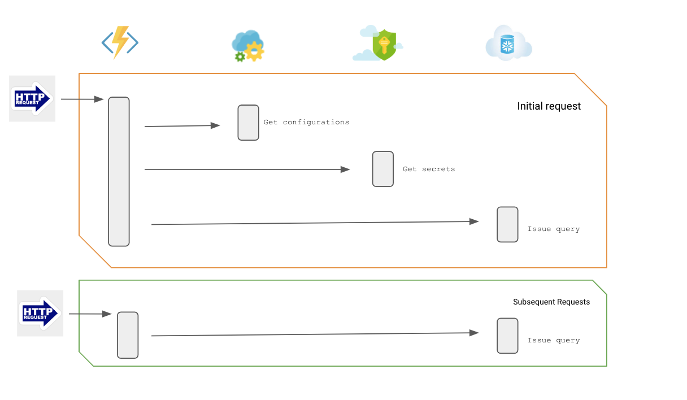
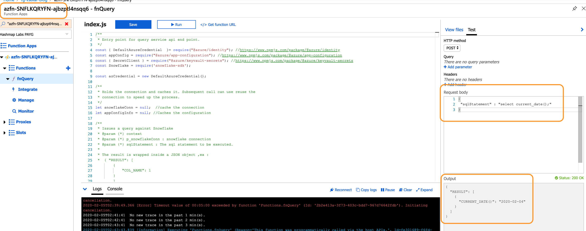
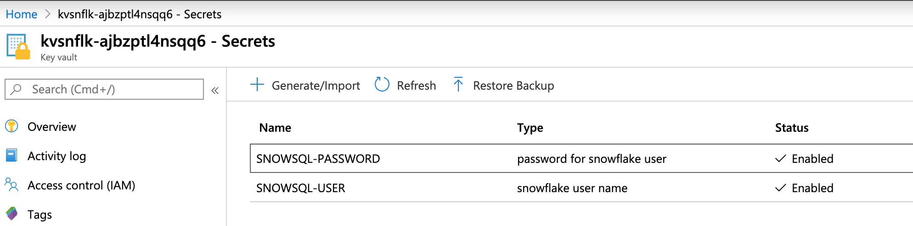
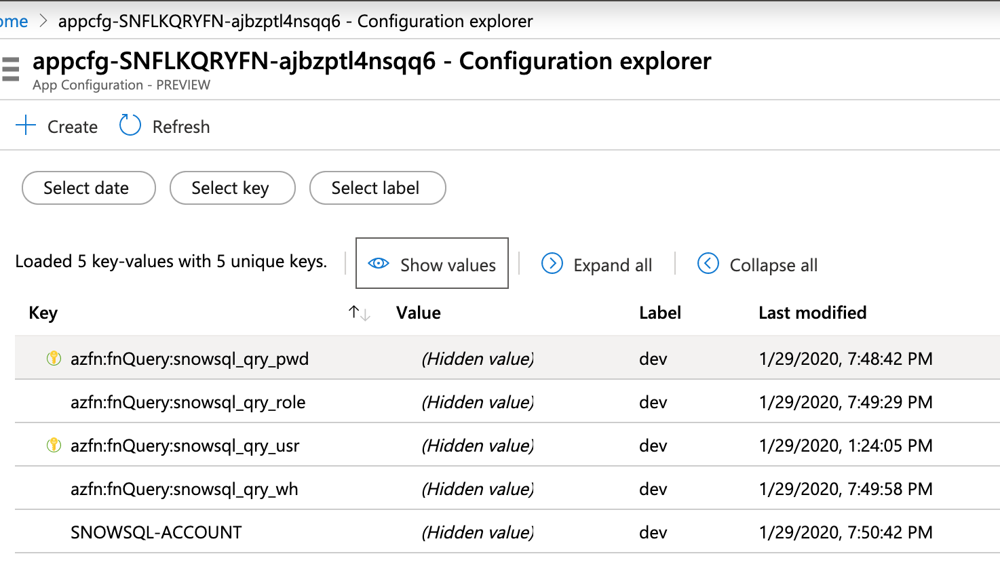
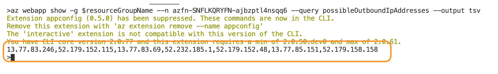

# Interfacing Azure Functions (Node) with Snowflake

_Date:15-Jan-2020_ 

## Overview
When it comes to having a sample azure function code that interfaces with Snowflake,we have definetly some good ones:
- [Azure Functions Connect to Snowflake: A Simple Test of the “snowflake-connector-python”](https://medium.com/@qiuyujx/azure-functions-connect-to-snowflake-a-simple-test-of-the-snowflake-connector-python-133a0c90c585)  
- [Securely Using Snowflake’s Python Connector within an Azure Function](https://medium.com/hashmapinc/securely-using-snowflakes-python-connector-within-an-azure-function-45756f2ad950)

And many more, but so far I have not seen an example of a implementation using Node. Why this matters, as it would have happen, i came across a client dev group ,they were more comfortable using Node.JS rather than Python. Hence in respect to them and also the community, I have created a prototype of an Azure Function, with a node implementation, which communicates with Snowflake. 

In doing this implementation, I have also adopted the usage of :
 - [Azure Key vault](https://azure.microsoft.com/en-us/services/key-vault/)
 - [Azure App Configuration](https://azure.microsoft.com/en-us/services/app-configuration/)

### Audience
This implementation is geared towards developers who wants to use Azure Function as a query mechanism with Snowflake. Through this implementation I will try to
 - Define an ARM template that deploys the various Azure components
 - Walk through the key points for configuring and interfacing the different components
 
### Scenario
 The code demonstrates where by the Azure Function process a query in Snowflake and returns a response. To follow the best practices, it does
  - Asynchronous call to Snowflake 
  - Secrets stored in key vault
  - Various configuration stored in Azure Application Config

  Such an azure function would be called by a client may be a browser or a mobile app. Mind that Snowflake is not an OLTP, it is suited for OLAP scenarios. Hence the type of queries should be analytical in nature, may be the result is transformed into a chart in the client app.

 
  
### Request & Response Interaction
  I have adopted the defacto scenario of exposing the Azure function as an HTTP endpoint. The request is like below :
  ```
    {
        "sqlStatement" : "select current_date();"
    }
  ```
  And the corresponding response would be :
  ```
    {
        "RESULT": [
            {
            "CURRENT_DATE()": "2020-01-22"
            }
        ]
    }
  ```



_____
## Component breakdown

### Component: Azure KeyVault  
We start of by configuring the secrets in an Azure KeyVault. The Azure KeyVault will hold the following:

| Key   | Description |
|:---:|:---:|
| SNOWSQL-USER | The user to connect to Snowflake. |
| SNOWSQL-PWD | The password for the Snowflake user. |



### Component: Azure App Configuration  
The [Azure App Configuration](https://azure.microsoft.com/en-us/services/app-configuration/) is a brand new service offering (in preview as of this writing), meant to centrally manage application settings and feature flags. 

A key point to note is that the app config is not meant to replace Azure Keyvault, which stores Key, Secrets and Certificate. It rathers complements and co-exists with Azure KeyVault service.

For the purpose of this demo, we configure the below configurations:

| Key   | Description | Label |
|:---:|:---:|:---:|
| SNOWSQL-ACCOUNT | The Snowflake Account uri prefix. | dev |
| azfn:fnQuery:snowsql_qry_wh | The warehouse to use for query execution. | dev |
| azfn:fnQuery:snowsql_qry_role | The role to use for query execution. | dev |
| azfn:fnQuery:snowsql_qry_role | The role to use for query execution. | dev |
| azfn:fnQuery:snowsql_qry_usr | The KV URI for SNOWSQL-USER secret. | dev |
| azfn:fnQuery:snowsql_qry_pwd | The KV URI for SNOWSQL-PASSWORD secret. | dev |



When retreiving values from the App Config, 
 - You can list & iterate all the config by supplying a partial key (ex: azfn:*)
 - You can filter keys based of a label (ex: dev)
 - Retrieve a value of the key based of a specific version.

 In the above to demonstrate, I have marked the label _*dev*_ to indicate development environment.

### Component: Azure Function (Node)
As mentioned earlier, this implementation is based of Node.Js. The logical flow is

1. Extract the _*sqlStatement*_ from the JSON request.
2. Retrieve the various application configuration for the azure function, cache the value once retreived for consequent call.
3. Retrieve the secrets stored in KeyVault and store it along with previous retained cache.
4. Connect to Snowflake. Cache the connection for subsequent calls.
5. Issue the query and return back the response to the caller.


Each of the above mentioned steps has been composed into individual function [fnQuery/index.js](./fnQuery/index.js).
I have enough comment to reflect what the various parts of the code does hence would not be repeating these in this page.

The Azure function retreives the value from the keyvault using API. This is different from the usual approach [Accessing Key Vault from Azure Functions using Managed Identities](https://markheath.net/post/managed-identity-key-vault-azure-functions). The reason behind is that the KV URI is managed and retreived via the App Config. What I like about this approach is that the version number is not part of the URI, hence by default the latest version will be retreived. Avoiding an hassle during secrets update process.

To keep it simple and be cost effective the function is deployed in _*Consumption*_ plan.

#### Query Operations
A thought might arise as to control the type of queries that gets executed. How to prevent an insert/delete statement being sent over the request. To enforce these you should define the appropriate grants on the role under which the function will execute.

#### Current limitations

- The code is a prototype, and might be definetely far from production ready from your perspective. You are free to adopt/use the implementation as you wish.

_____
## What I learnt

### Azure AppConfig
- If a key exist with a label, then it is mandatory to query with the key along with the label.
- The config pointing to a KV URI (ex: https://kvblog.vault.azure.net/secrets/SNOWSQL-PASSWORD) does not mean that they secret value will be returned. Whats returned is the KV URI, the caller would still need to make a seperate call to the KV to retrieve the secret.

### Securing Access to KeyVault
It is recomended that the KeyVault be accessible only from specific networks, [Ref](https://docs.microsoft.com/en-us/azure/key-vault/key-vault-best-practices). To start off we defined 'Managed Identities' & 'IAM Access Policy'.

Key Vault does provides a facility to restrict access from specific networks.


In order to achieve this, typically we should end up having the Azure Function run in a 'Dedicated App Service' plan, the reason being that then the azure function will have a definite IP address. As this is a costly option, especially if you are just starting your FAAS journey and dont have many functions developed yet, this way of securing is not possible. 

You might be asking what about the option 'Allow trusted Microsoft services to bypass this firewall?', well tried it and it does not always work for azure function. One option/method i can achieve this lock down, is to identify the outbound ip address for the azure function, [Ref: overview-inbound-outbound-ips](https://docs.microsoft.com/en-us/azure/app-service/overview-inbound-outbound-ips).  



we can now enter this in the KV network policies. 


_*NOTE:*_ As mentioned in the doc, the outbound ipaddress can change for any number of reasons. Hence you might need to define a regular schedule process that finds the ip address and update the network policy to alleviate the issue.

_____
## Deployments & Configurations

### ARM Template
Please refer to this document [arm/deploy.md](arm/deploy.md).

_____
### Developing Locally
Since there is a need for connecting to various azure resources like KeyVault & AppConfig, when developing locally, you would need to create a [Service Principal](https://docs.microsoft.com/en-us/powershell/azure/create-azure-service-principal-azureps?view=azps-3.4.0). Once created, capture the output into a temporary note. Then you need to update the following properties in 'local.settings.json'
- AZURE_CLIENT_ID
- AZURE_CLIENT_SECRET
- AZURE_TENANT_ID

This is explained in [Ref: NPM Azure Identity module](https://www.npmjs.com/package/@azure/identity).


