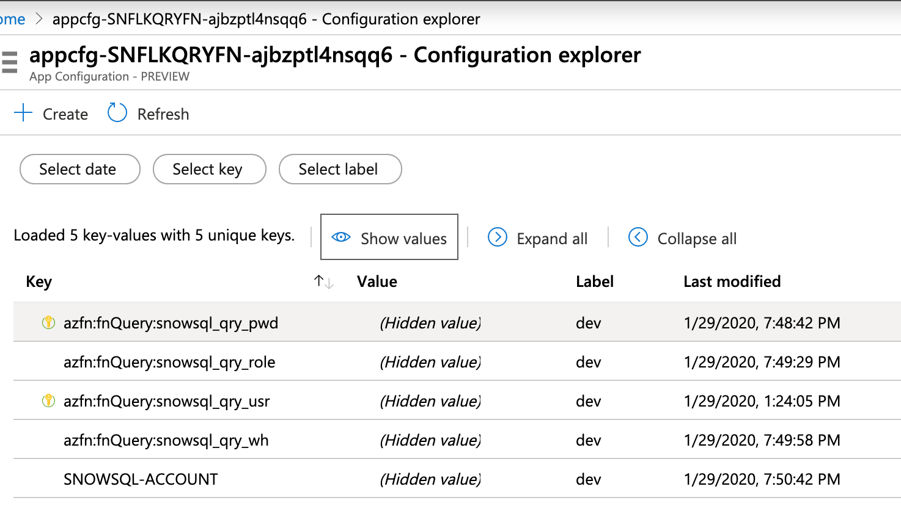
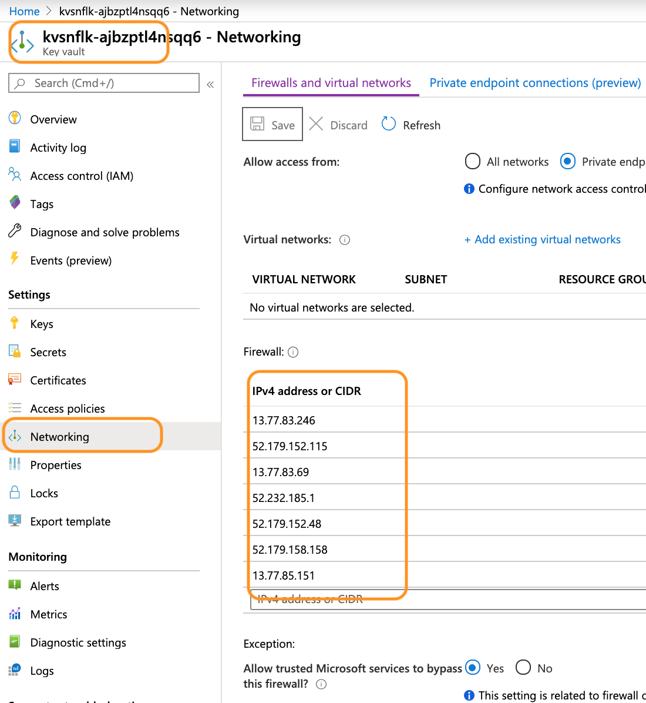

# ARM Template

_Date:15-Jan-2020_ 

To get you started on your prototype or adoption of this function, I have created
an ARM template.

## Pre-Requisite
 - Snowflake account, user credentials ,roles ,warehouse
 - Azure subscription
 - Azure resource group ,would recomend that the caller be an owner role

## Deployed Azure resources
- Azure storage account, which will house the data related to the azure function
- Azure Key vault with the secrets defined and values populated
- Azure App Config service
- Azure Function and its corresponding App Service (Consumption plan)

## Parameters
The following parameters needs to be set on deployment
- KV-SECRET-SNOWSQL-USER-VAL : The Snowflake user account
- KV-SECRET-SNOWSQL-PASSWORD-VAL : The Snowflake user account's password

## Post deployment

### Defining keys
Since the Azure App Config is still in preview, the ARM template does not have all the functionality of defining and configuring the key-values, KeyVault Secrets URI. Hence after the deployment the following steps needs to be done manually [Ref : AZ CLI commands for App Config](https://docs.microsoft.com/en-us/cli/azure/ext/appconfig/appconfig).

The cli commands have been captured in the script 'arm/appConfigConfigureKeys.sh'; you need to update the PARAM (ex: PARAM_RG) with the
appropriate value and execute the script.

Once ran the config should have created the keys like below

### Updating Azure Function App Setting
The Azure function would require the uri for the App Config. This needs to be configured in the Function application setting. 

The URI is retreived from the AccessKey's Connection String setting :

### Key vault access policy for Azure function
In order for the Azure function read the configuration off the key vault, we would need to define the access policy, as shown in the below screen shot:

### App Config access for Azure function
In order for the Azure function read the configuration off the App Config, we would need to define the access policy, as shown in the below screen shot:

### Function code deployment
The ARM template creates only the container for the function, to deploy the function code I used the visual code GUI.

### Key vault network policy for Azure function
Identify the outbound ip address for the azure function, [Ref: overview-inbound-outbound-ips](https://docs.microsoft.com/en-us/azure/app-service/overview-inbound-outbound-ips). In the below screenshot, we have done this via the az cli.  

we can now enter this in the KV network policies. 

_*NOTE:*_ As mentioned in the doc, the outbound ipaddress can change for any number of reasons. Hence you might need to define a regular schedule process that finds the ip address and update the network policy to alleviate the issue.

